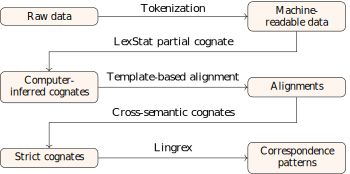
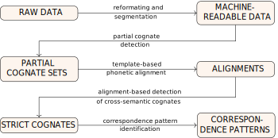
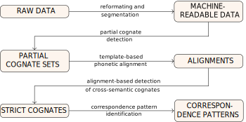
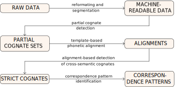
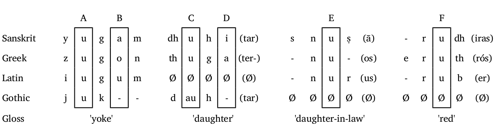

# Workflows for Computer-Assisted Language Comparison

@data-background:#f5f5f7
@data-transition:concave
@style:text-align:justify;
@style:font-size:85%;

---
@data-background:#f5f5f7
@style:text-align:center;
@style:font-size:100%;

## Workflows for Computer-Assisted Language Comparison
----

State of the Art

</img>

---
## @head:"Introduction"

</img>

--
## @head:"Introduction"
### @subhead:"Our team"

* The ERC funded project CALC (Computer-Assisted Language Comparison)
* Our team consists of people with experience in computational topics as well as classical linguistic topics.

</img>

--
## @head:"Introduction"
### @subhead:"The Gap between Computational and Traditional Historical Linguistics"

</img>

--
## @head:"Introduction"
### @subhead:"The Gap between Computational and Traditional Historical Linguistics"

</img>

--
## @head:"Introduction"
### @subhead:"The Gap between Computational and Traditional Historical Linguistics"

</img>

--
## @head:"Introduction"
### @subhead:"The Gap between Computational and Traditional Historical Linguistics"

</img>

--
## @head:"Introduction"
### @subhead:"Computer-Assisted Disciplines"

</img>

--
## @head:"Introduction"
### @subhead:"Computer-Assisted Disciplines"

A workflow connect between linguistic experts and computer applications so to enable scholars conduct qualitative and quantitative research at the same time.

* Data format is both human- and machine-readable.
* Follows a transparent guideline when handling linguistic datasets.
* Interactive tools are provided.
--

## @head:"Introduction"
### @subhead:"The Goals"

</img>

---
## @head:"Workflows of Computer-Assisted Language Comparison"
### @subhead:"Overview"

</img>

--
## @head:"Workflows of Computer-Assisted Language Comparison"
### @subhead:"Details of the workflows"

</img>

--
## @head:"Workflows or Computer-Assisted Language Comparison"
### @subhead:"mateiral and methods for the workflow illustration"

</img>

* Chen, Qiguang (2013). Miao and Yao language.
* 10 Hmong-Mien languages

--
## @head:"Workflows or Computer-Assisted Language Comparison"
### @subhead:"From raw data to machine-readable data"

</img>

--
## @head:"Workflows or Computer-Assisted Language Comparison"
### @subhead:"From raw data to machine-readable data"

</img>

--
## @head:"CALC workflows"
### @subhead:"From raw data to machine-readable data"

     \t Baheng,east \t Baheng, west \t Qiandong, east \t Qiandong, wesst
七   \t  tsha³¹,tsjung⁴⁴ \t tshang⁴⁴    \t     shung⁵³    \t      shung²²
月亮 \t la⁰³lha⁵⁵ \t ʔa⁰³lha⁵⁵ \t la⁴⁴la⁴⁴ \t pau¹¹la³³
星星 \t la⁰³qang³⁵ \t qa⁰³qang³⁵ \t qei²⁴qei²⁴ \t tei⁴⁴qei⁴⁴

<!-- +++add example on no-goes from cldf paper forkel ett al. +++ -->

--
@class:scrollable

 ID  \t DOCULECT       \t CONCEPT \t ENGLISH  \t VALUE      \t IPA \t TOKENS \t NOTE
 1   \t Baheng, east   \t 七      \t SEVEN    \t tsja³¹     \t     \t        \t synonym
 2   \t Baheng, east   \t 七      \t SEVEN    \t tsjung⁴⁴   \t     \t        \t synonym
 2   \t Baheng, west   \t 七      \t SEVEN    \t tsjang⁴⁴   \t     \t        \t
 3   \t Qiandong, east \t 七      \t SEVEN    \t sjung⁵³    \t     \t        \t
 4   \t Qiandong, wesst\t 七      \t SEVEN    \t sjung²²    \t     \t        \t
 5   \t Baheng, east   \t 月亮    \t MOON     \t la⁰³lha⁵⁵  \t     \t        \t
 6   \t Baheng, west   \t 月亮    \t MOON     \t ʔa⁰³lha⁵⁵  \t     \t        \t
 7   \t Qiandong, east \t 月亮    \t MOON     \t la⁴⁴la⁴⁴   \t     \t        \t
 8   \t Qiandong, wesst\t 月亮    \t MOON     \t pau¹¹la³³  \t     \t        \t
 9   \t Baheng, east   \t 星星    \t STAR    \t la⁰³qang³⁵  \t     \t        \t
 10  \t Baheng, west   \t 星星    \t STAR    \t qa⁰³qang³⁵  \t     \t        \t
 11  \t Qiandong, east \t 星星    \t STAR    \t qei²⁴qei²⁴  \t     \t        \t
 12  \t Qiandong, wesst\t 星星    \t STAR    \t tei⁴⁴qei⁴⁴  \t     \t        \t

--
## @head:"CALC workflows"
### @subhead:"From raw data to machine-readable data"

You can manually type the IPA and tokenize the IPA into phonemes.

But what if we are dealing with <b>hundreds of entries?</b> 

Is there an efficient way?

--
## @head:"CALC workflows"
### @subhead:"From raw data to machine-readable data"

A guideline to

<ul>
<li> Convert graphemes to phonetic sequences (IPA) </li>
  <ul style="list-style-type:none;">
    <li> tsj   ---->  tɕ </li>
    <li> ng    ---->   ŋ </li>
  </ul>
<li>Separate the phonetic sequences into sequences of phonemes</li>
tsja³¹  ----> tɕja³¹ ----> tɕ j a ³¹
</ul>

--
## @head:"CALC workflows"
### @subhead:"From raw data to machine-readable data"
@class:scrollable

ID  \t DOCULECT       \t CONCEPT \t ENGLISH  \t VALUE      \t IPA         \t TOKENS              \t COGID
 1   \t Baheng, east   \t 七      \t SEVEN    \t tsja³¹     \t  tɕa³¹     \t tɕ a ³¹              \t
 2   \t Baheng, east   \t 七      \t SEVEN    \t tsjung⁴⁴    \t tɕuŋ⁴⁴    \t tɕ u ŋ ⁴⁴            \t
 3   \t Baheng, west   \t 七      \t SEVEN    \t tsjang⁴⁴   \t  tɕaŋ⁴⁴    \t tɕ a ŋ ⁴⁴            \t
 4   \t Qiandong, east \t 七      \t SEVEN    \t sjung⁵³    \t  ɕuŋ⁵³     \t ɕ u ŋ ⁵³             \t
 5   \t Qiandong, wesst\t 七      \t SEVEN    \t sjung²²    \t  ɕuŋ²²     \t ɕ u ŋ ²²             \t
 6   \t Baheng, east   \t 月亮    \t MOON     \t la⁰³lha⁵⁵  \t la³/⁰+ɬa⁵⁵ \t l a ³/⁰ + ɬ a ⁵⁵      \t
 7   \t Baheng, west   \t 月亮    \t MOON     \t ʔa⁰³lha⁵⁵  \t ʔa³/⁰+ɬa⁵⁵ \t ʔ a ³/⁰ + ɬ a ⁵⁵       \t
 8   \t Qiandong, east \t 月亮    \t MOON     \t la⁴⁴la⁴⁴   \t la⁴⁴+la⁴⁴  \t l a ⁴⁴ + l a ⁴⁴       \t
 9   \t Qiandong, wesst\t 月亮    \t MOON     \t pau¹¹la³³  \t pɔ¹¹+la³³  \t p ɔ ¹¹ + l a ³³       \t
 10   \t Baheng, east   \t 星星    \t STAR    \t la⁰³qang³⁵  \t la³/⁰+qaŋ³⁵ \t l a ³/⁰ + q a ŋ ³⁵   \t
 11  \t Baheng, west   \t 星星    \t STAR    \t qa⁰³qang³⁵  \t qa³/⁰+qaŋ³⁵ \t q a ³/⁰ + q a ŋ ³⁵   \t
 12  \t Qiandong, east \t 星星    \t STAR    \t qei²⁴qei²⁴  \t qei²⁴+qei²⁴ \t q ei ²⁴ + q ei  ²⁴   \t
 13  \t Qiandong, wesst\t 星星    \t STAR    \t tei⁴⁴qei⁴⁴  \t tei⁴⁴+qei⁴⁴ \t t ei - ⁴⁴ + q ei ⁴⁴  \t

--
## @head:"CALC workflows"
### @subhead:"From segmented words to computer-inferred cognates"

</img>

--
## @head:"CALC workflows"
### @subhead:"From segmented words to computer-inferred cognates"

</img>

List, J. M. et al. (2016). Using sequence similarity networks to identify partial cognates in multilingual wordlists. In Proceedings of the 54th Annual Meeting of the Association for Computational Linguistics (Vol. 2, pp. 599-605).

--
## @head:"CALC workflows"
### @subhead:"From segmented words to computer-inferred cognates"

</img>

--
## @head:"CALC workflows"
### @subhead:"From segmented words to computer-inferred cognates"

 Three filtering criteria

<ul>
<li>No edges are drawn between two morphemes which occur in the same word.</li>
<li>No morpheme in one word is linked to two morphemes in another word, with the preference given to morpheme pairs with the lowest phonetic distance applying a greedy strategy.</li>
<li>Edges are only drawn when the phonetic distance between the morphemes is beyound a certain threshold.</li>
</ul>

--
## @head:"CALC workflows"
### @subhead:"From segmented words to computer-inferred cognates"

</img>

--
## @head:"CALC workflows"
### @subhead:"From segmented words to computer-inferred cognates"

@class:scrollable

ID  \t DOCULECT       \t CONCEPT \t ENGLISH  \t VALUE      \t IPA         \t TOKENS              \t COGID
 1   \t Baheng, east   \t 七      \t SEVEN    \t tsja³¹     \t  tɕa³¹     \t tɕ a ³¹              \t 3
 2   \t Baheng, east   \t 七      \t SEVEN    \t tsjung⁴⁴   \t  tɕuŋ⁴⁴     \t tɕ u ŋ ⁴⁴           \t 3
 3   \t Baheng, west   \t 七      \t SEVEN    \t tsjang⁴⁴   \t  tɕaŋ⁴⁴    \t tɕ a ŋ ⁴⁴            \t 3
 4   \t Qiandong, east \t 七      \t SEVEN    \t sjung⁵³    \t  ɕuŋ⁵³     \t ɕ u ŋ ⁵³             \t 3
 5   \t Qiandong, wesst\t 七      \t SEVEN    \t sjung²²    \t  ɕuŋ²²     \t ɕ u ŋ ²²             \t 3
 6   \t Baheng, east   \t 月亮    \t MOON     \t la⁰³lha⁵⁵  \t la³/⁰+ɬa⁵⁵ \t l a ³/⁰ + ɬ a ⁵⁵     \t 1908 1907
 7   \t Baheng, west   \t 月亮    \t MOON     \t ʔa⁰³lha⁵⁵  \t ʔa³/⁰+ɬa⁵⁵ \t ʔ a ³/⁰ + ɬ a ⁵⁵      \t 1909 1907
 8   \t Qiandong, east \t 月亮    \t MOON     \t la⁴⁴la⁴⁴   \t la⁴⁴+la⁴⁴  \t l a ⁴⁴ + l a ⁴⁴      \t 1908 1907
 9   \t Qiandong, wesst\t 月亮    \t MOON     \t pau¹¹la³³  \t pɔ¹¹+la³³  \t p ɔ ¹¹ + l a ³³       \t 1910 1907
 10   \t Baheng, east   \t 星星    \t STAR    \t la⁰³qang³⁵  \t la³/⁰+qaŋ³⁵ \t l a ³/⁰ + q a ŋ ³⁵   \t 1874 1870
 11  \t Baheng, west   \t 星星    \t STAR    \t qa⁰³qang³⁵  \t qa³/⁰+qaŋ³⁵ \t q a ³/⁰ + q a ŋ ³⁵   \t　1872 1870
 12  \t Qiandong, east \t 星星    \t STAR    \t qei²⁴qei²⁴  \t qei²⁴+qei²⁴ \t q ei ²⁴ + q ei  ²⁴   \t　1872 1870
 13  \t Qiandong, wesst\t 星星    \t STAR    \t tei⁴⁴qei⁴⁴  \t tei⁴⁴+qei⁴⁴ \t t ei - ⁴⁴ + q ei ⁴⁴  \t　1871 1870

--
## @head:"CALC workflows"
### @subhead:"From cognates to alignments"

</img>

--
## @head:"CALC workflows"
### @subhead:"From cognates to alignments"
<Alignment>

</img>

phonetic alignment techniques are well-known in historical linguistics and have been applied for quite some time now (List 2014, Prokić et al. 2009) 

--
## @head:"CALC workflows"
### @subhead:"From cognates to alignments"

Template-Based Alignment

* Languages with a rather restricted syllable structure, these techniques are actually not needed, as one could also align syllable-morphemes directly by using their *prosodic templates*
* a typical Chinese syllable, for example, consists of *initial*, *medial*, *nucleus*, *coda* and *tone* (Wang 1996)

<!--  add another slide (same title and subtitle) in order to illustrate templatte-based alignments, ideally with a table -->
--
## @head:"CALC workflows"
### @subhead:"From cognates to alignments"

|                |    Initial (i)  | Medial (m) |    Nucleus (n)   | Coda (c) | Tone (t)|
|:--------------:|:---------------:|:----------:|:----------------:|:--------:|:-------:|
|  Baheng, east  |       p         |    j       |       a          |          |  ³⁵     |
|  Baheng, west  |       t         |    j       |       a          |          |  ³⁵     |
|  Chuanqiandian |      tʂ         |    -       |       i          |          |  ⁴³     |
| Qiandong, east |      ts         |    -       |       a          |          |  ²⁴     |

--
## @head:"CALC workflows"
### @subhead:"From cognates to alignments"

@class:scrollable

ID  \t DOCULECT        \t ENGLISH \t TOKENS             \t STRUCTURE \t ALIGNMENT \t COGID
 1   \t Baheng, east   \t SEVEN   \t tɕ a ³¹             \t i n t     \t tɕ a - ³¹ \t 3
 2   \t Baheng, west   \t SEVEN   \t tɕ a ŋ ⁴⁴           \t i n c t   \t tɕ a ŋ ⁴⁴ \t 3
 3   \t Qiandong, east \t SEVEN   \t ɕ u ŋ ⁵³            \t i n c t   \t  ɕ u ŋ ⁵³ \t 3
 4   \t Qiandong, wesst\t SEVEN   \t ɕ u ŋ ²²            \t i n c t   \t ɕ u ŋ ²²  \t 3
 5   \t Baheng, east   \t MOON    \t l a ³/⁰ + ɬ a ⁵⁵    \t i n t + i n t \t l a ³/⁰ + ɬ a ⁵⁵\t 1908 1907
 6   \t Baheng, west   \t MOON    \t ʔ a ³/⁰ + ɬ a ⁵⁵    \t i n t + i n t \t ʔ a ³/⁰ + ɬ a ⁵⁵ \t 1909 1907
 7   \t Qiandong, east \t MOON    \t l a ⁴⁴ + l a ⁴⁴    \t i n t + i n t \t l a ⁴⁴ + l a ⁴⁴ \t 1908 1907
 8   \t Qiandong, wesst\t MOON    \t p ɔ ¹¹ + l a ³³    \t i n t + i n t \t p ɔ ¹¹ + l a ³³ \t 1910 1907
 9   \t Baheng, east   \t STAR    \t l a ³/⁰ + q a ŋ ³⁵ \t i n t + i n c t \t l a ³/⁰ + q a ŋ ³⁵ \t 1874 1870
 10  \t Baheng, west   \t STAR    \t q a ³/⁰ + q a ŋ ³⁵ \t　i n t + i n c t \t q a ³/⁰ + q a ŋ ³⁵ \t 1872 1870
 11  \t Qiandong, east \t STAR    \t q ei ²⁴ + q ei  ²⁴ \t　i n t + i n t \t q ei ²⁴ + q ei - ²⁴ \t  1872 1870
 12  \t Qiandong, wesst\t STAR    \t t ei - ⁴⁴ + q ei ⁴⁴\t　i n t + i n t \t t ei - ⁴⁴ + q ei - ⁴⁴\t 1871 1870

--
## @head:"CALC workflows"
### @subhead:"From alignments to strict, cross-semantic cognates"

</img>

--
## @head:"CALC workflows"
### @subhead:"From alignments to strict, cross-semantic cognates"

Reasons

* Language change includes semantic shift.
* Many SEA languages are rich in compounding, we find many words being re-used across the lexicon, even in small numbers of vocabulary.

--
## @head:"CALC workflows"
### @subhead:"From alignments to strict, cross-semantic cognates"

<!--add an illustrational graphic here, that shows how alignments that are compatible can be merged-->

</img>

--
## @head:"CALC workflows"
### @subhead:"From alignments to strict, cross-semantic cognates'

* our algorithm for automatic cognate detection needs to start from words with the same meaning, as it would be too much noise for it to handle, if we had it search across all meanings
* therefore, we need to find *cross-semantic* (=normal) cogantes in a second stage
* we apply a new algorithm, inspired by maximum clique coverage, to *merge* cognates in our data into larger groups
* our basic check is if two alignments are compatible with each other, and if the words are *strictly* cognate

--
## @head:"CALC workflows"
### @subhead:"From alignments to strict, cross-semantic cognates'

</img>

--
## @head:"CALC workflows"
### @subhead:"From alignments to strict, cross-semantic cognates"

@class:scrollable

ID  \t DOCULECT        \t ENGLISH \t TOKENS             \t STRUCTURE \t ALIGNMENT \t CROSSID            \t COGID
 1   \t Baheng, east   \t SEVEN   \t tɕ a ³¹             \t i n t     \t tɕ a - ³¹ \t 3                  \t 3
 2   \t Baheng, west   \t SEVEN   \t tɕ a ŋ ⁴⁴           \t i n c t   \t tɕ a ŋ ⁴⁴ \t 3                  \t 3
 3   \t Qiandong, east \t SEVEN   \t ɕ u ŋ ⁵³            \t i n c t   \t  ɕ u ŋ ⁵³ \t 3                  \t 3
 4   \t Qiandong, wesst\t SEVEN   \t ɕ u ŋ ²²            \t i n c t   \t ɕ u ŋ ²²  \t 3                  \t 3
 5   \t Baheng, east   \t MOON    \t l a ³/⁰ + ɬ a ⁵⁵    \t i n t + i n t \t l a ³/⁰ + ɬ a ⁵⁵\t 1908 351 \t 1908 1907
 6   \t Baheng, west   \t MOON    \t ʔ a ³/⁰ + ɬ a ⁵⁵    \t i n t + i n t \t ʔ a ³/⁰ + ɬ a ⁵⁵ \t 41 351	\t 1909 1907
 7   \t Qiandong, east \t MOON    \t l a ⁴⁴ + l a ⁴⁴    \t i n t + i n t \t l a ⁴⁴ + l a ⁴⁴ \t 1908 351 \t 1908 1907
 8   \t Qiandong, wesst\t MOON    \t p ɔ ¹¹ + l a ³³    \t i n t + i n t \t p ɔ ¹¹ + l a ³³ \t 1910 351  \t 1910 1907
 9   \t Baheng, east   \t STAR    \t l a ³/⁰ + q a ŋ ³⁵ \t i n t + i n c t \t l a ³/⁰ + q a ŋ ³⁵ \t 1874 1834 \t 1874 1870
 10  \t Baheng, west   \t STAR    \t q a ³/⁰ + q a ŋ ³⁵ \t　i n t + i n c t \t q a ³/⁰ + q a ŋ ³⁵ \t 1872 1834 \t 1872 1870
 11  \t Qiandong, east \t STAR    \t q ei ²⁴ + q ei  ²⁴ \t　i n t + i n t \t q ei ²⁴ + q ei - ²⁴ \t  1872 1834 \t 1872 1870
 12  \t Qiandong, wesst\t STAR    \t t ei - ⁴⁴ + q ei ⁴⁴\t　i n t + i n t \t t ei - ⁴⁴ + q ei - ⁴⁴\t 1234 1834 \t 1871 1870

--

</img>

--
## @head:"CALC workflows"
### @subhead:"From strict, cross-semantic cognates to sound correspondence patterns"

</img>

(List, 2019)
--
## @head:"CALC workflows"
### @subhead:"From strict, cross-semantic cognates to sound correspondence patterns"

</img>

--
## @head:"Illustration of the Workflow"
### @subhead:"From Raw Data to Segmented Data"
<a style="color:#2d1f23;text-align:center" href='http://calc.digling.org/profile/'> http://calc.digling.org/profile/</a>
--
## @head:"Illustration of the Workflow"
### @subhead:"EDICTOR"

EDICTOR: a web-based tool to edit, analyse, and publish etymological data.

<a style="color:#2d1f23" href='http://edictor.digling.org/' align='middle'></img></a>

---
## @head:"Conclusion and outlook"
</img>

--
## @head:"Conclusion and outlook"
### @subhead:"Discussion"

Possible improvements

<ul>
<li>Semi-automatic reconstruction</li>
<li>Clearer integration of automatic and semi-automatic methods in the workflow</li>
<li>How to visualise the results?</li>
</ul>

--
## @head:"Conclusion and outlook"
### @subhead:"Discussion"

Challenges

<ul>
<li>Lexical reconstruction: how to reconstruct whole words?</li>
<li>Sound change representation of all changes along some phylogeny with sound laws</li>
</ul>

---

Thanks for Your Attention!

CALC members:

<ul>                        
<li> Dr. Johann-Mattis List (Group Leader)</li>    
<li> Dr. Yunfan Lai (Post-Doc)</li>
<li> Dr. Tiago Tresoldi (Post-Doc)</li>
<li> Nathanael E.Schweikhard (Doctoral student)</li>
<li> Mei-Shin Wu (Doctoral student)</li>
</ul>
