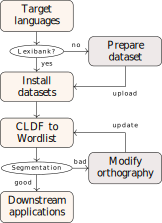

# Workflows for Computer-Assisted Language Comparison

@data-background:#f5f5f7
@data-transition:concave
@style:text-align:justify;
@style:font-size:85%;

---
@data-background:#f5f5f7
@style:text-align:center;
@style:font-size:100%;

## State of the Art
----

Workflows for Computer-Assisted Language Comparison

 
</img>

---

## @head:"Our team"

* The ERC funded project CALC (Computer-Assisted Language Comparison)
* Our team consists of people with experience in computational topics as well as classical linguistic topics.

</img>

---
## @head:"Introduction"

</img>
Workflows for Computer-Assisted Language Comparison

--
## @head:"Introduction"
### @subhead:"What is a computer-assisted approach"

Classical approach 

* Suitable for small datasets. 
* High accuracy
* High flexibility

Computational approach

* Suitable for large datasets. 
* High consistency
* High efficiency

--
## @head:"Introduction"
### @subhead:"What is a computer-assisted approach"

A workflow involves linguistic experts and computing power.

* Analyse and manipulate large-scale linguistic datasets
* Follow a transparency guideline when handling linguistic datasets. 

--

## @head:"Introduction"
### @subhead:"The Goals"

* Introduce
* Embrace
* Feedback

</img>

 

---
## @head:"CALC workflows"

</img>

--
## @head:"CALC workflows"
### @subhead:"From raw data to machine-readable data"

--
## @head:"CALC workflows"
### @subhead:"From segmented words to computer-inferred cognates"

--
## @head:"CALC workflows"
### @subhead:"From cognates to alignments"

--
## @head:"CALC workflows"
### @subhead:"From alignments to strict, cross-semantic cognates"

--
## @head:"CALC workflows"
### @subhead:"From strict cognates to correspondence patterns"

---
## @head:"Conclusion and outlook" 

--
## @head:"Conclusion and outlook"
### @subhead:"Conclusion"

--
## @head:"Conclusion and outlook"
### @subhead:"Outlook"

---

Thanks for Your Attention!

CALC members:

<ul>                        
<li> Dr. Johann-Mattis List (Group Leader)</li>    
<li> Dr. Yunfan Lai (Post-Doc)</li>
<li> Dr. Tiago Tresoldi (Post-Doc)</li>
<li> Nathanael E.Schweikhard (Doctoral student)</li>
<li> Mei-Shin Wu (Doctoral student)</li>
</ul>
